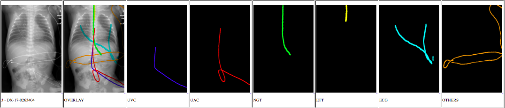

# PediatricXray100

Please go to [this link](https://forms.gle/kkpUhygWjhwLjP9D7) to download the dataset.
If you have any issues, please raised it on GitHub.

### Citations
If you find it useful and are using the dataset provided here in a publication, please cite our paper:

Yi, X., Adams, S. J., Henderson, R. D., & Babyn, P. (2020). Computer-aided Assessment of Catheters and Tubes on Radiographs: How Good Is Artificial Intelligence for Assessment?. Radiology: Artificial Intelligence, 2(1), e190082. https://doi.org/10.1148/ryai.2020190082